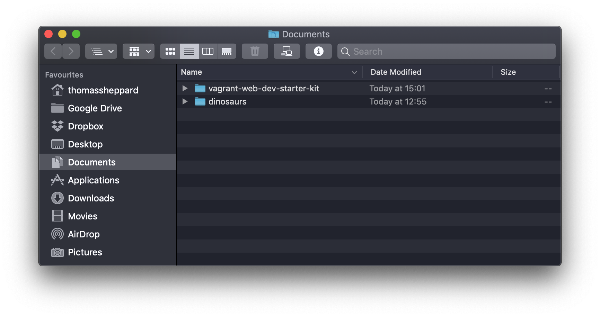
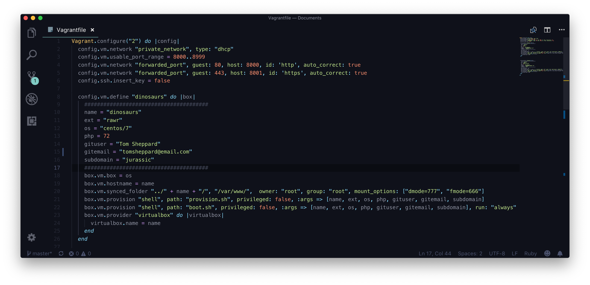

# Vagrant Web Dev Starter Kit 🦄

Vagrant can be a bit confusing at first so this Starter Kit will help you create a quick and easy development environment setup for your unique project.
Supports: Windows, MacOS, Ubuntu

# Installation 💽

Install *VirtualBox, Vagrant* and *vbguest*.

[Oracle VM VirtualBox](https://www.virtualbox.org/)

[Vagrant by HashiCorp](https://www.vagrantup.com/)

[dotless-de/vagrant-vbguest](https://github.com/dotless-de/vagrant-vbguest)

*Vagrant* has a synced folder which only works if you have the *vbguest* installed:

    vagrant plugin install vagrant-vbguest

# Setup 📦

To create a new project, create a folder with the name of your project in the same directory as the *vagrant-web-dev-starter-kit*.

In the example above I have created a project called *dinosaurs*. Dinosaurs are cool 🦕

Open up the Vagrantfile and you'll see the dinosaurs project is already refined.

The fields inbetween the hashes can be configured to make your desired box.

The table below gives you guidance on how you can configure these settings.

[Guide](README/guide.csv)

## Multiple boxes

There is multibox support! Just copy the block below and add it to the Vagrantfile underneath your previous block. Give the block a name and fill out the configurtion section.

    config.vm.define "" do |box|
        #######################################
        name = ""
        ext = ""
        os = ""
        php = 
        gituser = ""
        gitemail = ""
        subdomain = ""
        #######################################
        box.vm.box = os
        box.vm.hostname = name
        box.vm.synced_folder "../" + name + "/", "/var/www/",  owner: "root", group: "root", mount_options: ["dmode=777", "fmode=666"]
        box.vm.provision "shell", path: "provision.sh", privileged: false, :args => [name, ext, os, php, gituser, gitemail, subdomain]
        box.vm.provision "shell", path: "boot.sh", privileged: false, :args => [name, ext, os, php, gituser, gitemail, subdomain], run: "always"
        box.vm.provider "virtualbox" do |virtualbox|
          virtualbox.name = name
        end
      end

Once the machine is finished it is recommended you do a `vagrant reload`.

    vagrant reload

The reason for this is for SElinux to be completed disabled it needs to switch off. Plus it's a good test to make sure everything boots up properly when you shut the box down.

# Your machine 🔐

vagrant ssh - you should see an imformative message when booting up your box telling you the ip and it's name. Lovely.

On your mac go to the hosts file and add your ip address with the our local dns

    sudo nano /etc/hosts

    123.4.5.6     dinosaurs.local
    123.4.5.6     www.dinosaurs.local

Great but if you go to the sites httpd connection you'll see this:

insert image of site not secure.

To fix this you need to open up Keychain Access and import the rootCA.pem file generated in your project folder into the systems category.
Once done double click the certificate and change to 'Always trust'. You will be prompted for your password and then try reloading your webpage.

# Complete 🌈

Blah blah stuff will go here